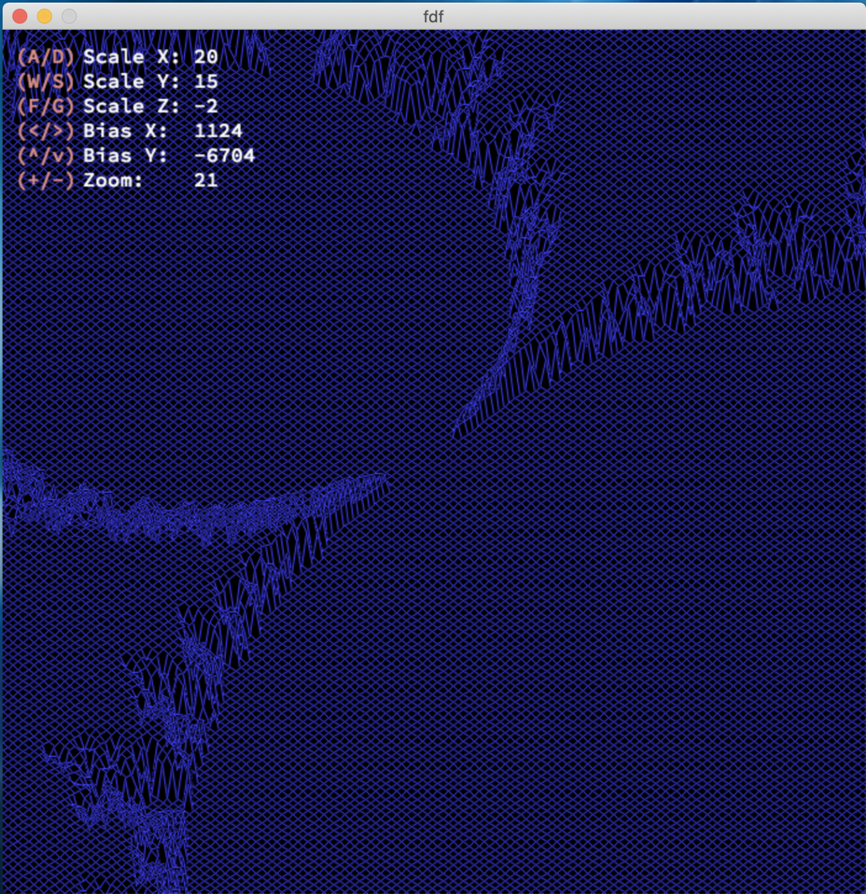
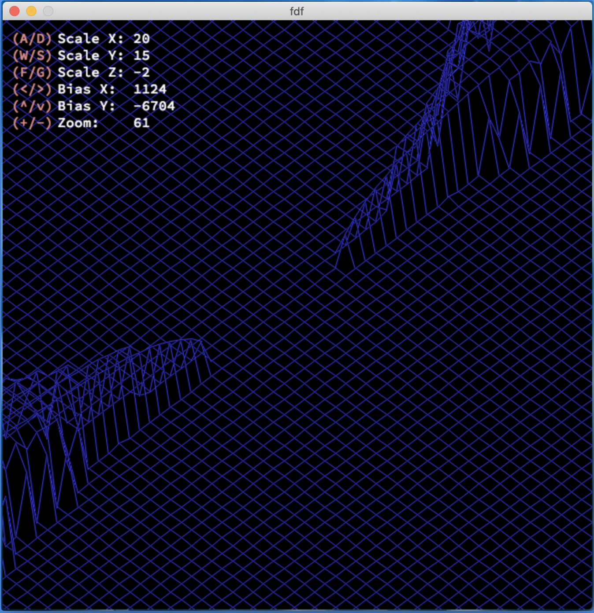
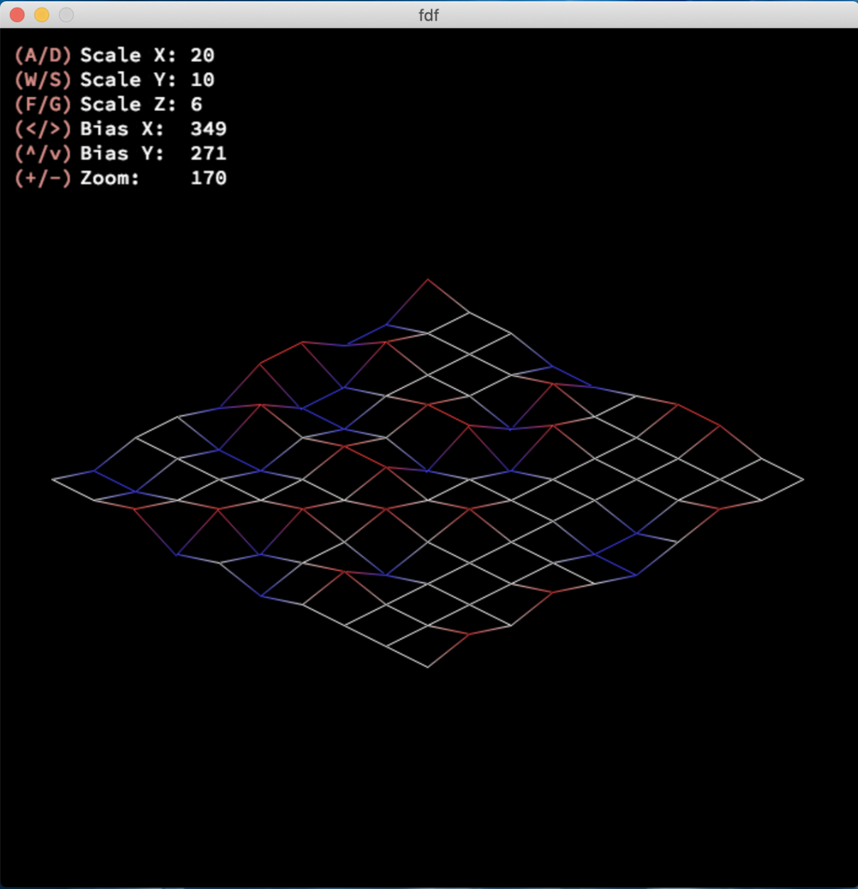
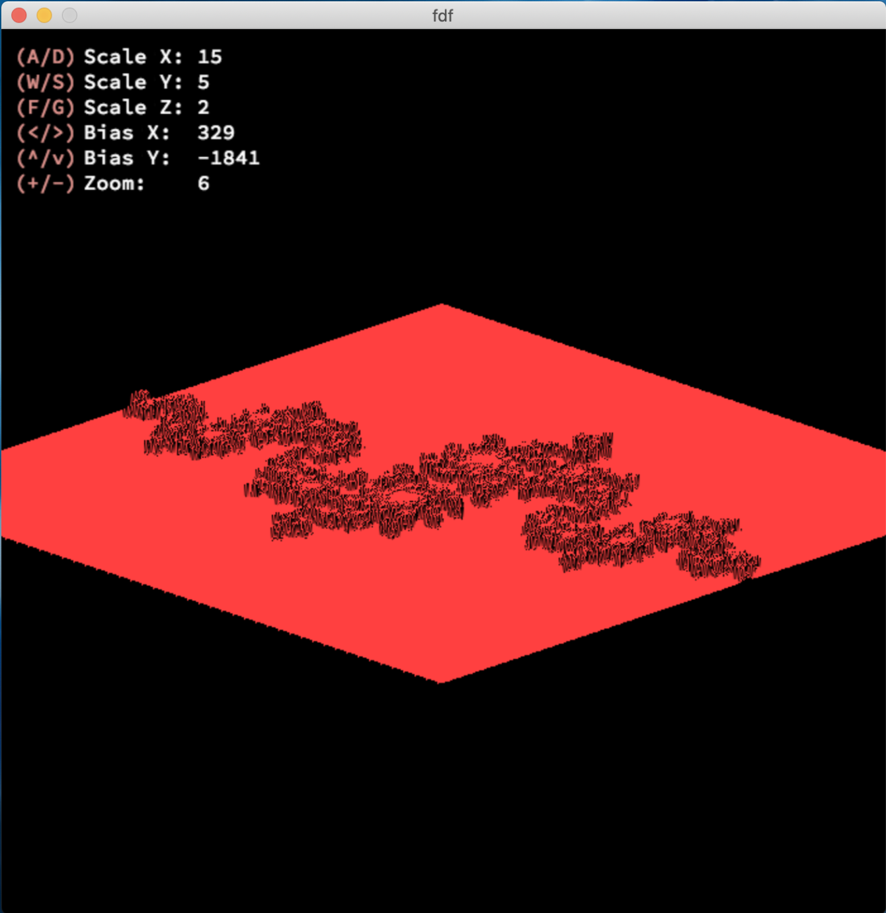

# fdf

"fdf" project of School 21 (Russia)

> Attention! -- Compiles properly only on MacOS
> (because of MLX library)

## Info:

App has some control over the axis scales, image position and zoom

|                  |         |
| :--------------: | :-----: |
|      A / D       | Scale X |
|      W / S       | Scale Y |
|      F / G       | Scale Z |
| arLeft / arRight | Bias X  |
|  arUp / arDown   | Bias Y  |
|      + / -       |  Zoom   |

[Xiaolin Wu's line algorithm](https://en.wikipedia.org/wiki/Xiaolin_Wu%27s_line_algorithm) implemented for smooth lines drawing

Dots with calculated Z coordinate above 0 are Red and below 0 are Blue

---

## Images:

|                      |                      |
| :------------------: | :------------------: |
|  |  |
|  |  |
